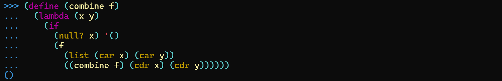
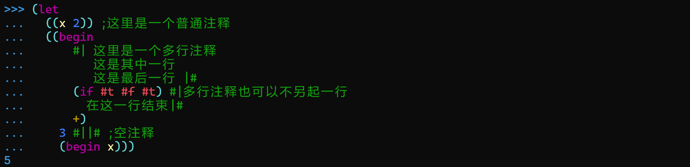
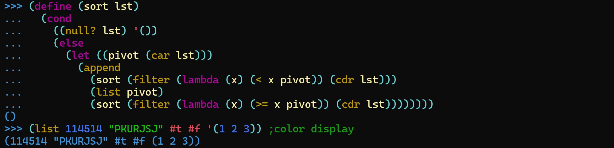

# Mini-Lisp 解释器

这是北京大学2025年春 [软件设计实践](https://pku-software.github.io) 的课程大作业。解释器的一切实现均遵循 [Mini-Lisp语言规范](https://pku-software.github.io/mini-lisp-spec/) 。

通过命令行运行时，若直接以 `./mini-lisp.exe` 启动则进入 `REPL` 模式，若以 `./mini-lisp.exe <filename>` 启动则进入文件模式。

除了语言规范中的规定外，解释器支持以下的附加功能：

#### 多行输入

当输入的内容并未结束而换行时，解释器将输出提示符 `... ` ，继续等待用户输入，直到完整的语句结束：

#### 自动缩进

实现较简单，仅依靠所处的括号层级来决定（参考其他图片），默认每层缩进2个字符宽度。

#### 注释

允许使用在行末使用 `;` 来创建单行注释，使用 `#|` 和 `|#` 包裹中间的内容形成多行注释。

#### 代码高亮

解释器根据接收到的 `token` 类型进行高亮。代码高亮在每次输入回车后进行，默认的颜色对应如下：

| Token类型 | 颜色 |
| :---------: | :-------: | 
| 字符串型字面量 | 浅绿色 |
| 数型字面量 | 浅蓝色 |
| 布尔型字面量 | 浅红色 |
| 特殊形式 | 浅紫色 |
| 内置过程 | 黄色 |
| 其他变量或过程名 | 浅黄色 |
| 括号，引号等 | 浅青色 |
| 提示符 | 青色 |
| 注释 | 绿色 |

> 💡注：
> 这里的代码高亮仅支持长度不超过终端宽度的代码；换言之代码不应由于超出终端宽度限制而折行，否则会存在未高亮代码存留。（如果要实现正确的代码高亮需要调用 `Windows API` 或其他终端操作库，这里是不调库的简易实现。）

#### 后记
大作业得分 `19.5/20` 软设真是超级好课 QAQ
